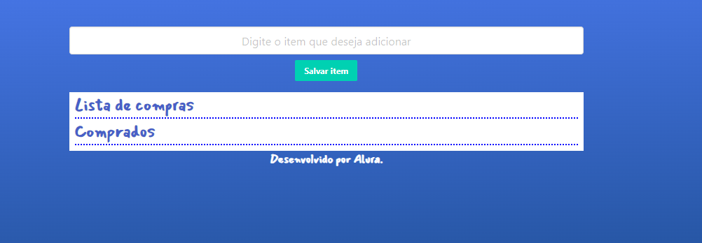
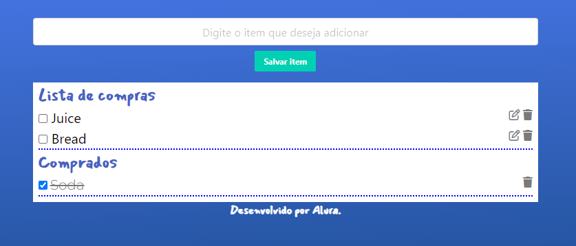

# Alura-Lista de Compras
 
This is a solution to the [JavaScript: manipulando objetos](https://cursos.alura.com.br/course/javascript-manipulando-objetos). Alura Front-end school help you improve your coding skills by building realistic projects.  

## Table of contents

- [Overview](#overview)
  - [The challenge](#the-challenge)
  - [Screenshot](#screenshot)
  - [Links](#links)
- [My process](#my-process)
  - [Built with](#built-with)
  - [What I learned](#what-i-learned)
  - [Continued development](#continued-development)
  - [Useful resources](#useful-resources)
- [Author](#author)

## Overview

This is the final project for "Lista de Compras" website using JavaScript.

### The challenge

Users should be able to:

Add, edit, delete items from list.

### Screenshot

### Links

- Solution URL: [GitHub](https://github.com/ViniCellist/Alura-Lista-Compras)

## My process

Used semantic HTML5, CSS, JavaScript and JSON.

### Built with

- Semantic HTML5 markup
- CSS3
- JavaSctipt
- JSON

### What I learned

Practicing responsive websites.

### Continued development

I know for sure that this projects opened my mind to see webpage creation in a whole new perspective

### Useful resources

- [HTML 5](https://developer.mozilla.org/en-US/docs/Web) - HTML documentation.
- [CSS3](https://developer.mozilla.org/pt-BR/docs/Web/CSS) - CSS documentation.
- [JS](https://developer.mozilla.org/pt-BR/docs/Web/JavaScript) - JS documentation.

## Author

- GitHub - [Projects](https://github.com/ViniCellist)
- Frontend Mentor - [Profile](https://www.frontendmentor.io/profile/ViniCellist)
- LinkedIn - [Professional](https://www.linkedin.com/in/viniciussouzaduarte/)
- Instagram - [Personal](https://www.instagram.com/vinicius_duartesd/)